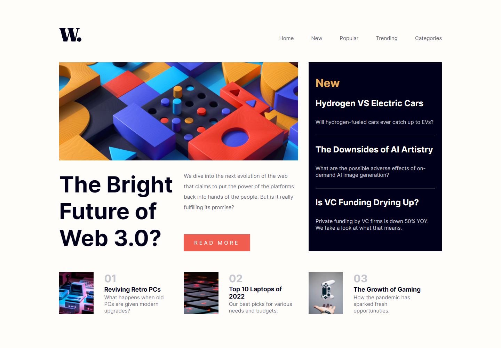

# Frontend Mentor - News homepage solution

I completed this challenge with only HTML5 and CSS. It helps me to improve my coding skills in CSS and HTML5.

## Table of contents

- [My process](#my-process)
  - [Built with](#built-with)
  - [What I learned](#what-i-learned)
- [Overview](#overview)
  - [The challenge](#the-challenge)
  - [Links](#links)
  - [Screenshot](#screenshot)
  

## My process

### Built with

- Semantic HTML5 markup
- CSS custom properties
- Flexbox

### What I learned

I'm still on my learning front-end development path. I learned how to use flexbox yet, so I decided to use flexbox on one challenge. And this challenge helps me about understanding flexbox better.

## Overview

### The challenge

This is a solution to the [News homepage challenge on Frontend Mentor](https://www.frontendmentor.io/challenges/news-homepage-H6SWTa1MFl). Frontend Mentor challenges help you improve your coding skills by building realistic projects. 

### Links

- Live Site URL: [https://news-homepage-challenge-fm.netlify.app/](https://news-homepage-challenge-fm.netlify.app/)

### Screenshots

- Desktop Screenshot

- Mobile Screenshot

